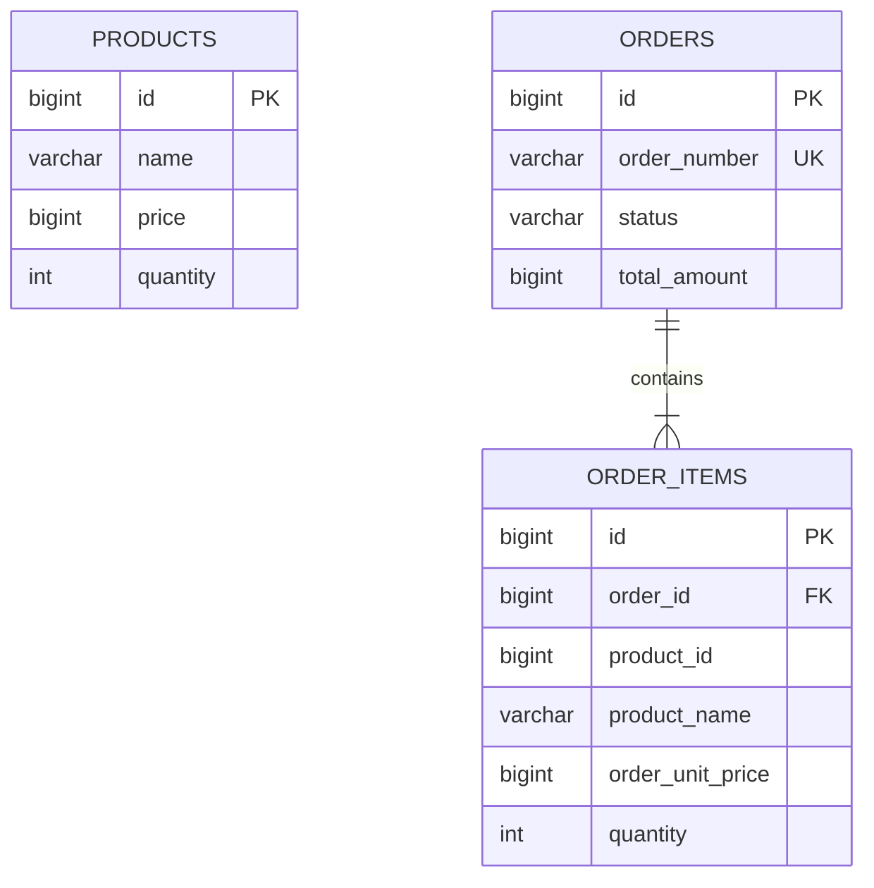
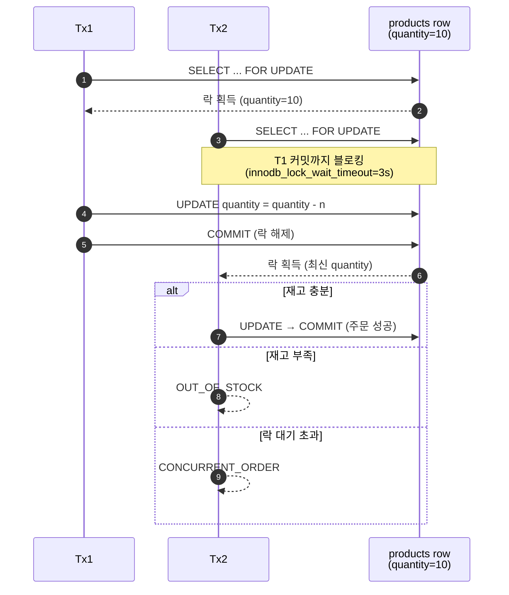

# orderdemo

[](https://github.com/gayeonkim91/orderdemo/actions/workflows/ci.yml)

## 프로젝트 소개

`orderdemo`는 Spring Boot로 작성한 주문 데모 프로젝트다.
주문 생성과 주문 조회에 집중했고, 이 과정에서 필요한 기본 검증과 예외 응답을 포함했다.

## 현재 구현 범위

구현한 기능은 아래와 같다.

- 주문 생성 API
- 주문 단건 조회 API
- 주문 요청 입력값 검증
- 중복 상품 ID 주문 방지
- 존재하지 않는 상품 검증
- 재고 부족 검증과 재고 차감
- 재고 차감 동시성 제어
- 주문 총액 계산
- 주문 시점 상품명/주문 단가 저장
- 공통 예외 응답 처리

구현하지 않은 항목은 아래와 같다.

- 상품 등록/조회 API
- 주문 취소/상태 변경
- 결제/배송 처리

재고 차감은 단일 트랜잭션 안에서 처리하며, 주문 생성 시 상품 row에 비관적 락을 걸어 같은 상품에 대한 동시 주문을 순차적으로 처리한다.
락 대기 시간이 길어지는 상황을 제한하기 위해 MySQL 세션의 `innodb_lock_wait_timeout`을 3초로 설정했다.

## 기술 스택

- Java 21
- Spring Boot 3.5.12
- Spring Web
- Spring Data JPA
- Spring Validation
- Flyway
- MySQL
- Gradle
- JUnit 5
- Docker Compose
- Testcontainers
- GitHub Actions
- `ulid-creator`

## 패키지 구조

```text
src/main/java/com/example/orderdemo
├── api
│   ├── error
│   └── order
├── application
│   └── order
├── common
│   ├── config
│   └── exception
├── domain
│   ├── order
│   └── product
└── repository
```

패키지별 역할은 아래와 같다.

- `api/order`
  [OrderController.java](src/main/java/com/example/orderdemo/api/order/OrderController.java) 에서 `POST /api/orders`, `GET /api/orders/{orderNumber}`를 처리한다.
  요청 DTO는 `CreateOrderRequest`, `CreateOrderItemRequest`, 응답 DTO는 `OrderCreateResponse`, `OrderDetailResponse`, `OrderItemResponse`로 분리했다.
- `api/error`
  [GlobalExceptionHandler.java](src/main/java/com/example/orderdemo/api/error/GlobalExceptionHandler.java) 가 `BusinessException`, validation 예외, 기타 예외를 API 응답으로 변환한다.
- `application/order`
  [OrderCreateService.java](src/main/java/com/example/orderdemo/application/order/OrderCreateService.java) 가 주문 생성 흐름을 처리하고, [OrderQueryService.java](src/main/java/com/example/orderdemo/application/order/OrderQueryService.java) 가 주문 조회를 처리한다.
  주문번호 생성은 [UlidOrderNumberGenerator.java](src/main/java/com/example/orderdemo/application/order/UlidOrderNumberGenerator.java) 가 담당한다.
- `domain/order`
  [Order.java](src/main/java/com/example/orderdemo/domain/order/Order.java), [OrderItem.java](src/main/java/com/example/orderdemo/domain/order/OrderItem.java), [OrderStatus.java](src/main/java/com/example/orderdemo/domain/order/OrderStatus.java) 가 주문 상태와 주문 항목을 표현한다.
- `domain/product`
  [Product.java](src/main/java/com/example/orderdemo/domain/product/Product.java) 에 재고 차감 로직이 있다.
- `repository`
  `OrderRepository`, `ProductRepository`가 JPA 접근을 담당한다.
- `common`
  에러 코드와 비즈니스 예외, JPA Auditing 설정이 들어 있다.

## 데이터 모델



`order_items.product_id`, `product_name`, `order_unit_price`는 주문 시점 스냅샷이며 `products`에 대한 외래키를 두지 않는다.
상품 정보가 변경돼도 기존 주문 데이터에 영향을 주지 않게 하기 위한 선택이다 (핵심 설계 결정 3 참고).
스키마 정의는 [V1__init.sql](src/main/resources/db/migration/V1__init.sql) 에 있다.

## 핵심 설계 결정

### 1. 레이어드 패키징 선택
현재 프로젝트 범위는 주문 생성/조회 중심의 작은 애플리케이션이므로, 기능별 패키징보다 레이어드 패키징을 선택했다.
도메인 경계가 충분히 자라지 않은 시점이어서, `api`, `application`, `domain`, `repository`, `common` 레이어를 나누는 쪽이 더 단순하고 설명 가능하다고 판단했다.

### 2. API 모델과 Application 모델 분리
HTTP 요청/응답 모델과 서비스 입력/출력 모델을 분리했다.
컨트롤러는 요청 검증과 응답 반환에, 서비스는 유스케이스 처리에 집중하도록 책임을 나눴다.

### 3. Order를 aggregate root로 두고 OrderItem은 상품 스냅샷을 보관
`Order`를 aggregate root로 두고, `OrderItem`은 `Product` 엔티티를 직접 참조하지 않도록 설계했다.
주문 시점의 `productId`, `productName`, `orderUnitPrice`, `quantity`를 저장해 이후 상품 정보 변경이 기존 주문 데이터에 영향을 주지 않도록 했다.

### 4. 도메인 규칙은 엔티티에 배치
주문 생성 과정의 핵심 규칙은 가능한 한 도메인 객체가 직접 가지도록 했다.
`Order`는 빈 주문 방지, 총액 계산, 상태 초기화를 담당하고, `Product`는 재고 차감을 담당한다.
`OrderCreateService`는 상품 조회, 중복 검사, 주문 생성 흐름을 조합하는 application service 역할만 수행한다.

### 5. 동일 상품의 중복 주문 라인 금지
한 주문 요청 안에서 같은 `productId`를 여러 번 보내는 것은 허용하지 않았다.
현재 모델에는 옵션이나 판매자 단위로 라인을 구분할 이유가 없어서, 중복 요청을 차단하는 편이 API 계약을 더 단순하게 만든다고 판단했다.

### 6. 주문번호와 내부 PK 분리
주문 엔티티는 DB PK 외에 별도의 `orderNumber`를 가진다.
외부 식별자와 내부 식별자를 분리해 식별자 정책을 분리했다.

### 7. 재고 차감 동시성 제어
주문 생성 시 상품을 조회할 때 `PESSIMISTIC_WRITE` 락을 사용한다.
같은 상품에 대한 동시 주문은 먼저 락을 획득한 트랜잭션이 재고를 차감하고 커밋한 뒤, 다음 트랜잭션이 최신 재고를 기준으로 재고 부족 여부를 다시 판단한다.

여러 상품을 한 주문에서 함께 처리할 때는 상품 ID를 정렬한 뒤 조회한다.
락 획득 순서를 고정해 서로 다른 주문이 같은 상품들을 다른 순서로 잠그면서 발생할 수 있는 deadlock 가능성을 낮추기 위한 선택이다.

락 대기 실패는 주문 경합 상황으로 보고 `CONCURRENT_ORDER` 예외 응답으로 변환한다.



검증은 [OrderCreateServiceConcurrencyTest](src/test/java/com/example/orderdemo/application/order/OrderCreateServiceConcurrencyTest.java) 가 담당한다.
재고 10개인 상품에 대해 동시 요청 20개를 `CountDownLatch`로 같은 시점에 출발시켰을 때 결과는 아래와 같다.

| 항목 | 기대값 | 실제 |
| --- | --- | --- |
| 주문 성공 | 10 | 10 |
| `OUT_OF_STOCK` 실패 | 10 | 10 |
| 최종 재고 | 0 | 0 |
| 저장된 주문 수 | 10 | 10 |

비관적 락이 직렬화를 보장하므로 재고보다 많은 주문은 성공할 수 없고, 음수 재고도 발생하지 않는다.

**트레이드오프와 확장 방향.** 비관적 락은 같은 상품에 대한 주문을 직렬화하므로 상품 단위 처리량이 트랜잭션 길이와 락 보유 시간에 묶인다.
단일 인스턴스 / 낮은 경합 환경에서는 단순성과 검증 가능성이 이 비용을 정당화한다고 봤지만, 처리량이 병목이 된다면 아래 방향을 검토할 수 있다.

- **DB 조건부 업데이트** — `UPDATE products SET quantity = quantity - ? WHERE id = ? AND quantity >= ?` 의 affected rows로 재고 부족을 판단한다. 락 보유 시간이 짧고 코드 변경이 가장 적다.
- **낙관적 락 + 재시도** — 버전 컬럼 기반 업데이트로 락 없이 처리하고 충돌 시 재시도한다. 경합이 낮을 때 처리량이 가장 좋지만, 경합이 잦으면 재시도 폭주가 생긴다.
- **Redis 사전 차감 + outbox** — 재고 카운터를 Redis에 두고 `DECRBY`로 즉시 응답, DB 반영은 비동기로 정합화한다. 처리량은 가장 크지만 운영 복잡도와 장애 복구 시 일관성 부담이 가장 크다.

### 8. 과설계 지양
현재 단계에서는 서비스 인터페이스, CQRS 분리, factory/policy/port-adapter 구조 같은 추상화를 도입하지 않았다.
작은 범위에서 필요한 수준의 구조만 유지하고, 설명 가능성과 테스트 가능성을 우선했다.

### 9. 테스트를 계층별로 분리
도메인 규칙은 unit test, 주문 생성 유스케이스는 service integration test, HTTP 요청/응답 계약은 controller test(MockMvc)로 검증했다.
테스트 목적이 섞이지 않도록 책임을 나눴다.

## 로컬 실행

### 사전 준비

- JDK 21
- Docker / Docker Compose

### 실행 절차

```bash
# 1. MySQL 컨테이너 기동 (Flyway가 스키마를 자동으로 적용한다)
docker compose up -d db

# 2. 애플리케이션 실행
#    application.yml 기본값은 Docker 네트워크 내부 호스트 `db`를 가리키므로,
#    호스트 머신에서 직접 띄울 때는 DB_URL을 localhost로 오버라이드한다.
DB_URL='jdbc:mysql://localhost:3306/orderdemo?serverTimezone=Asia/Seoul&characterEncoding=UTF-8' \
  ./gradlew bootRun
```

기본 DB 계정은 `app` / `app1234`이며 [docker-compose.yml](docker-compose.yml) 에 정의돼 있다.
애플리케이션은 `http://localhost:8080`에서 응답한다.

### 시드 데이터

상품 등록 API는 현재 범위에 없으므로, 주문 API를 호출하려면 SQL로 상품을 직접 삽입한다.

```bash
docker exec -i orderdemo-mysql mysql -uapp -papp1234 orderdemo <<'SQL'
INSERT INTO products (name, price, quantity, created_at, updated_at)
VALUES ('상품1', 1000, 10, NOW(6), NOW(6)),
       ('상품2', 2300, 5,  NOW(6), NOW(6));
SQL
```

### 주문 호출 예시

```bash
# 주문 생성
curl -X POST http://localhost:8080/api/orders \
  -H 'Content-Type: application/json' \
  -d '{"items":[{"productId":1,"quantity":1},{"productId":2,"quantity":2}]}'

# 주문 조회
curl http://localhost:8080/api/orders/{orderNumber}
```

## API 예시

### 주문 생성

`POST /api/orders`

요청 예시:

```json
{
  "items": [
    { "productId": 1, "quantity": 1 },
    { "productId": 2, "quantity": 2 }
  ]
}
```

성공 응답 예시:

```json
{
  "orderId": 10,
  "orderNumber": "ORDER-01HV...",
  "status": "CREATED",
  "totalAmount": 5600
}
```

실패 응답 예시:

```json
{
  "code": "OUT_OF_STOCK",
  "message": "재고가 부족합니다. productId = 2"
}
```

동시 주문 경합으로 락 대기 시간이 초과되면 아래와 같이 응답한다.

```json
{
  "code": "CONCURRENT_ORDER",
  "message": "주문이 동시에 발생했습니다."
}
```

### 주문 조회

`GET /api/orders/{orderNumber}`

성공 응답 예시:

```json
{
  "orderId": 10,
  "orderNumber": "ORDER-01HV...",
  "status": "CREATED",
  "totalAmount": 5600,
  "orderItems": [
    {
      "productId": 1,
      "productName": "상품1",
      "orderUnitPrice": 1000,
      "quantity": 1,
      "lineAmount": 1000
    },
    {
      "productId": 2,
      "productName": "상품2",
      "orderUnitPrice": 2300,
      "quantity": 2,
      "lineAmount": 4600
    }
  ]
}
```

실패 응답 예시:

```json
{
  "code": "ORDER_NOT_FOUND",
  "message": "주문을 찾을 수 없습니다. orderNumber = ORDER-UNKNOWN"
}
```

## 테스트 설명

테스트 파일은 아래와 같다.

- [ProductTest.java](src/test/java/com/example/orderdemo/domain/product/ProductTest.java)
- [OrderTest.java](src/test/java/com/example/orderdemo/domain/order/OrderTest.java)
- [OrderItemTest.java](src/test/java/com/example/orderdemo/domain/order/OrderItemTest.java)
- [OrderControllerTest.java](src/test/java/com/example/orderdemo/api/order/OrderControllerTest.java)
- [OrderCreateServiceTest.java](src/test/java/com/example/orderdemo/application/order/OrderCreateServiceTest.java)
- [OrderCreateServiceConcurrencyTest.java](src/test/java/com/example/orderdemo/application/order/OrderCreateServiceConcurrencyTest.java)
- [OrderdemoApplicationTests.java](src/test/java/com/example/orderdemo/OrderdemoApplicationTests.java)

역할은 아래와 같다.

- 도메인 테스트
  `Product`, `Order`, `OrderItem`의 생성 규칙과 계산을 확인한다.
- API 테스트
  `OrderControllerTest`에서 요청 검증과 응답 형식을 확인한다.
- 통합 테스트
  `OrderCreateServiceTest`, `OrderCreateServiceConcurrencyTest`, `OrderdemoApplicationTests`는 스프링 컨텍스트와 DB 연결이 필요한 테스트다.
  `OrderCreateServiceConcurrencyTest`는 재고 10개 상품에 동시 요청 20개를 보낸 뒤 정확히 10건만 성공하고 나머지 10건은 `OUT_OF_STOCK`으로 실패하는지, 최종 재고가 0인지 검증한다.

애플리케이션 기본 datasource 값은 Docker Compose 기준으로 `db` 호스트를 사용한다.
Flyway가 테스트 DB 스키마를 적용하고, 통합 테스트는 Testcontainers로 MySQL 컨테이너를 띄워 실행한다.

### 테스트 실행

```bash
./gradlew test
```

Docker daemon이 실행 중이면 통합 테스트가 MySQL 컨테이너를 자동으로 띄운다.
별도로 `docker compose up -d db`를 먼저 실행할 필요는 없다.

## CI

GitHub Actions로 CI를 구성했다.
push와 pull request에서 `./gradlew test`를 실행하며, 이 과정에서 Flyway와 Testcontainers 기반 통합 테스트도 함께 검증한다.
